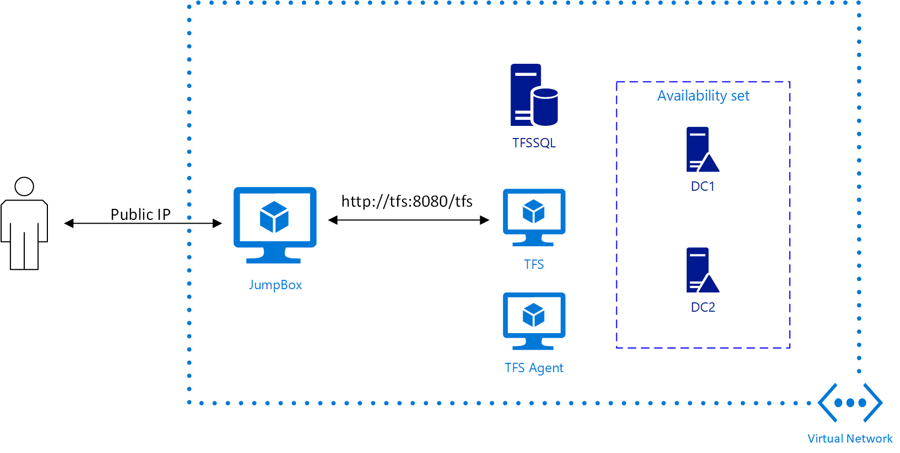

Private TFS in Azure
---------------------------

Microsoft [Azure](https://azure.microsoft.com/en-us/) offers a hosted DevOps experience with [Vistual Studio Team Services](https://www.visualstudio.com/team-services/) (VSTS). It is great, but sometimes organizations would like to host their own [Team Foundation Server](https://www.visualstudio.com/tfs/) (TFS). A particularly relevant use case is users in the [Microsoft Government Cloud](https://azure.microsoft.com/en-us/overview/clouds/government/) where VSTS is not yet available. Deploying a TFS Server with database and build agents can be complicated. 

This template illustrates how to a TFS server and agents. The topology is illustrated below:

The deployment needs an existing subnet (in a virtual network) and a domain to join. The basic networking and domain controllers can be deployed with the [core-network](../core-network) template, or the network and TFS deployment can be combined as in [devnet-tfs](../devnet-tfs)

<a href="https://transmogrify.azurewebsites.net/tfs/azuredeploy.json?environment=gov" target="_blank">

